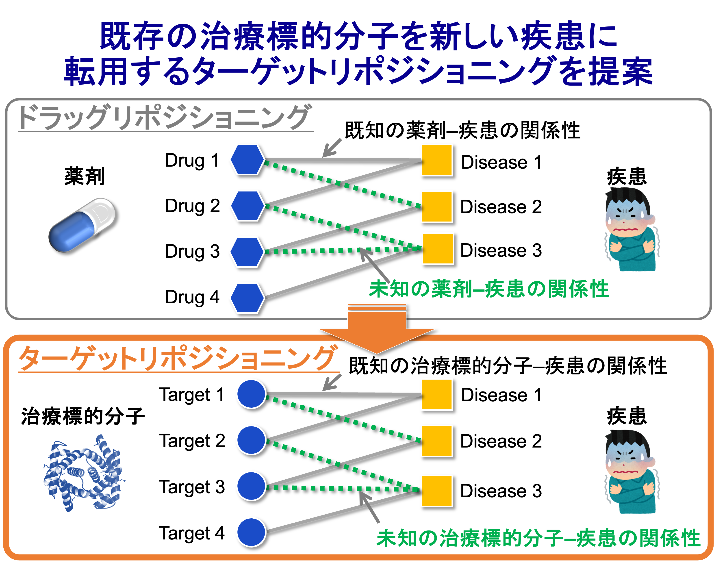

# Research Overview

Here, I introduce the research topics and methodologies I am currently working on.

### Main Research Topics
- Development of AI and machine learning methods for **target repositioning**
- Prediction of therapeutic and druggable targets for **rare and intractable diseases** using AI and omics data
- Development of AI methods to predict **synergistic drug combinations** that enhance treatment efficacy

---

#### AI-based Target Repositioning  
##### Proposal of Target Repositioning  
([Namba _et al_., _Bioinformatics_, 38(Supplement_1) i68–i76, 2022](https://doi.org/10.1093/bioinformatics/btac240))

Identifying therapeutic targets (biomolecules whose modulation can lead to disease treatment) is typically the first step in drug development. If inappropriate targets are chosen at this stage, it significantly reduces the success rate of subsequent clinical trials. However, most targets easily inferred from pathological knowledge have already been extensively studied, and the exhaustion of novel therapeutic targets has become a global issue.

To address this, our group proposed a new concept called **target repositioning**. In drug discovery, **drug repositioning**—predicting new indications for existing drugs—has proven useful because these drugs already have established safety and toxicity profiles, enabling cost-effective applications to new diseases.

Target repositioning expands this idea from drugs to **therapeutic targets**. Specifically, it predicts new disease indications for existing target molecules. Because these molecules have already been profiled in human contexts, they offer a cost-effective avenue for treating other diseases.

Furthermore, while drug repositioning is often economically challenging due to patent expiration and lower pricing potential, target repositioning allows for the **design of new compounds** that regulate the repositioned targets. This provides **greater incentives for pharmaceutical companies**, making it not only scientifically but also commercially viable.

  <a href="../research.html">
    [日本語版はこちら / Japanese version]
  </a>

