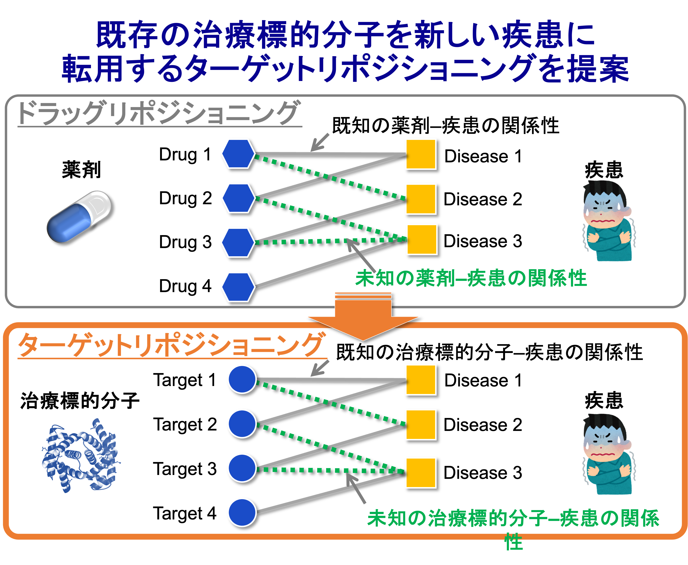

  <a href="./en/research.html" target="_blank" rel="noopener noreferrer">
    [English version]
  </a>

## **研究紹介**

現在取り組んでいる研究テーマや方法論について紹介します。

### **主な研究テーマ**
- ターゲットリポジショニング（target repositioning）のためのAI・機械学習手法の開発
- 希少疾患や難治性疾患に対する治療標的分子・創薬標的分子予測のためのAI・機械学習手法の開発
- 治療効果を高める薬剤組み合わせ予測のためのAI・機械学習手法の開発

#### **ターゲットリポジショニングのためのAI・機械学習手法の開発**
##### **ターゲットリポジショニングの提案**
（[Namba _et al_., _Bioinformatics_, 38(Supplement_1) i68-i76, 2022](https://doi.org/10.1093/bioinformatics/btac240)）
　医薬品開発では治療標的分子/創薬標的分子（制御することで疾患の治療に繋がる生体分子）の同定は一番最初の過程に想定します。ここで不適切な治療標的分子/創薬標的分子を選択してしまうと、後の臨床試験における成功率が大幅に低下します。しかし、病理学的な知識から容易に推定できる治療標的分子/創薬標的分子の多くは研究し尽くされており、治療標的分子/創薬標的分子の枯渇が世界的な課題となっています。  
　そこで、我々のグループでは「**ターゲットリポジショニング**」と言う新しい概念を初めて提案しました。治療薬の予測においては、既存の薬剤について、元々の適用疾患とは異なる別の疾患への転用を予測する「ドラッグリポジショニング」が有用とされています。既存の薬剤は、すでにヒトでの副作用や毒性などのプロファイリングが蓄積しているため、少ないコストで新しい疾患への適用を実現することができます。我々は、この考え方を治療薬から治療標的分子/創薬標的分子へと拡張するターゲットリポジショニングを提案しました。ターゲットリポジショニングでは、既存の治療標的分子/創薬標的分子に関して、元々の適用疾患とは異なる別の疾患への転用を予測します。既存の治療標的分子/創薬標的分子は、すでにヒトでのプロファイリングが蓄積しているため、従来よりも少ないコストで新しい疾患への適用を実現できる可能性があります。またドラッグリポジショニングでは、対象の既存薬の特許が切れていることが多く、薬価が高騰しにくくビジネス的には収益化が難しい傾向にありますが、ターゲットリポジショニングでは対象の治療標的分子/創薬標的分子を制御する化合物を新たにデザインすることで、製薬会社のインセンティブを得やすいというメリットがあります。

  <a href="./en/research.html" target="_blank" rel="noopener noreferrer">
    [English version]
  </a>

